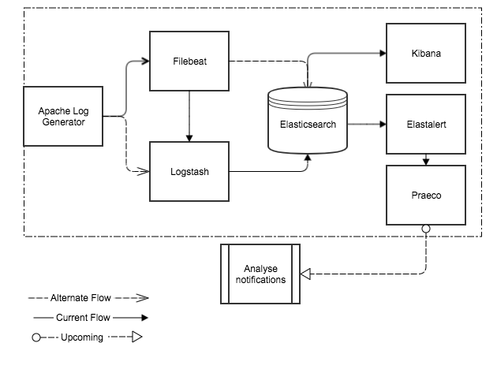

# Logging infra

### Introduction
Collection of appliactions to setup centralize logging system for local testing

Run in docker
~~~~~~~~~~~~~
    $ git clone https://github.com/prabhatmaurya/plabs-sre-admin.git
    $ cd plabs-sre-admin/logging-infra
    $ docker-compose up [--build] -d
~~~~~~~~~~~~~
